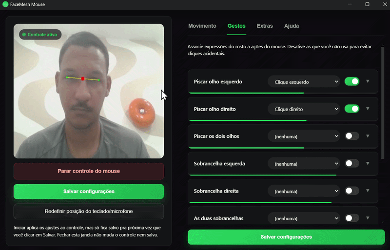

# Acessibility Mouse Tracking

Controle o mouse com a cabeça, sem precisar das mãos.



## Por que existe

Esse projeto nasceu pra ajudar pessoas com limitação motora nas mãos ou
braços a usar o computador. Rastreando o rosto pela webcam, o app move o
cursor com o movimento da cabeça e transforma expressões faciais (piscar,
levantar sobrancelha, abrir a boca) em cliques: dá pra usar o mouse
inteiro sem tocar em nada.

## Como funciona

- Move a cabeça → o cursor se move (igual um mouse de verdade, sensibilidade
  ajustável).
- Faz um gesto facial (piscar o olho esquerdo, por exemplo) → dispara um
  clique. Nove gestos disponíveis, cada um configurável pra qualquer ação
  (clique esquerdo, direito, duplo, scroll) ou desligado.
- Cada gesto exige segurar a expressão por um tempinho antes de valer, pra
  uma piscada natural não virar clique sem querer.
- Depois de configurar, salva e roda em segundo plano com ícone na
  bandeja, não precisa deixar nenhuma janela aberta.
- Um círculo flutuante sempre visível abre o teclado virtual do Windows e a
  digitação por voz, pra quem também precisa digitar sem as mãos.
- Se você usar o mouse físico, o app cede o controle na hora e devolve
  quando você parar.

Atalhos globais: `Ctrl+Alt+P` pausa/retoma o controle pela cabeça,
`Ctrl+Alt+O` reabre a janela de configuração.

## Requisitos

- Windows
- Webcam com permissão de câmera liberada

## Usar

```powershell
pnpm install
pnpm dev
```

Abre a janela de configuração na primeira execução: prévia da câmera à
esquerda, abas de ajuste à direita (Movimento, Gestos, Extras, Ajuda).
Ajuste sensibilidade e gestos, clique em "Salvar configurações" e depois em
"Iniciar controle do mouse".

## Testes

```powershell
pnpm test
```

## Gerar instalador (.exe)

```powershell
pnpm dist
```

O instalador fica em `apps/desktop/release/FaceMesh Mouse Setup <versão>.exe`.

- Primeira execução é mais lenta (carrega o modelo de rastreamento facial).
- Instalador não assinado → Windows SmartScreen avisa no primeiro uso.
- Precisa conceder permissão de câmera ao app na primeira vez.

## Open source

Projeto open source sob licença [MIT](LICENSE). Fique à vontade pra usar,
modificar e contribuir.
